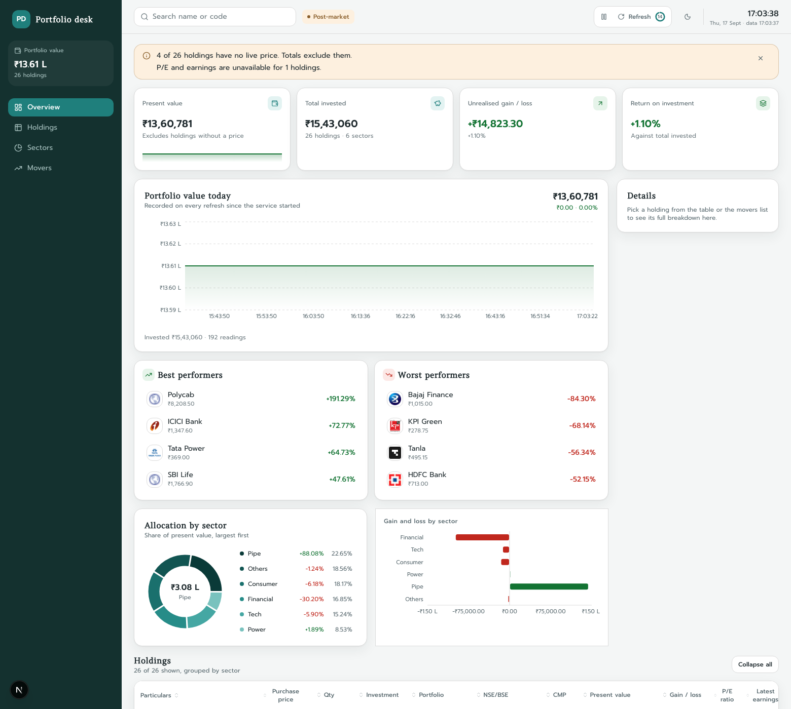
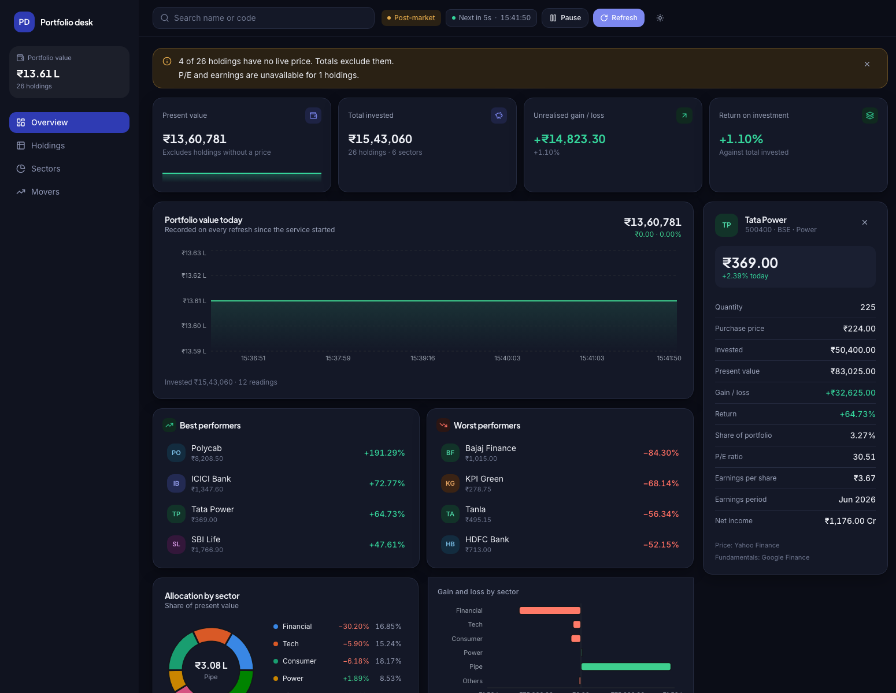

# Portfolio dashboard

A real-time dashboard for a portfolio of Indian equities. It reads holdings exported from an Excel
sheet, pulls the current market price from Yahoo Finance and the P/E ratio and latest quarterly
earnings from Google Finance, refreshes every 15 seconds, and groups everything by sector with
per-sector subtotals and a grand total. Gains are green, losses are red.





## Features

- 26 holdings across 6 sectors, grouped into collapsible sector blocks with subtotals
- Current market price, present value and gain/loss refreshed every 15 seconds without re-rendering
  the table or shifting the layout
- Price cells flash green or red when the quote moves between polls
- P/E ratio and latest quarterly earnings (EPS, period, net income in the tooltip) per holding
- Sector allocation donut and gain/loss-by-sector bar chart
- Sorting on every column, search by name or exchange code, expand/collapse all sectors
- Stacked cards instead of a table below 768px, light and dark themes, keyboard-operable throughout
- Degrades instead of failing: stale values are flagged per cell, warnings explain what is missing,
  and the last good data stays on screen when the API goes away
- `DATA_MODE=mock` runs the whole thing with simulated prices and no network access

## Tech stack

| Layer | Choice |
|---|---|
| Frontend | Next.js 16 (App Router), React 19, TypeScript, Tailwind CSS v4, TanStack Table v8, Recharts, next-themes |
| Backend | Node.js, Express, TypeScript, yahoo-finance2, axios + cheerio, zod, p-limit, pino |
| Shared | Types, zod schemas, calculations and formatters used by both sides |
| Tooling | npm workspaces, vitest, supertest, Testing Library, ESLint, Prettier |

## Prerequisites

- Node.js 20.9 or newer (22 LTS recommended — `yahoo-finance2` v4 asks for 22+ and prints a notice
  on 20, but works)
- npm 10 or newer

## Setup

```bash
git clone <repo-url>
cd portfolio-dashboard
npm install

cp apps/api/.env.example apps/api/.env
cp apps/web/.env.example apps/web/.env.local

npm run import:excel     # reads data/portfolio.xlsx -> apps/api/data/holdings.json
npm run dev              # api on :4000, web on :3000
```

Open http://localhost:3000.

`npm run import:excel` is only needed when the sheet changes; the generated `holdings.json` is
committed.

### Mock mode

No network, no scraping, stable demo:

```bash
DATA_MODE=mock npm run dev
```

The header shows a "Demo data" badge. Prices start within ±20% of each purchase price and move by a
small random walk on every poll.

## Scripts

| Script | What it does |
|---|---|
| `npm run dev` | Builds the shared package, then runs api, web and the shared watcher together |
| `npm run build` | Builds shared, api and web for production |
| `npm start` | Runs the compiled api and web |
| `npm test` | Runs every unit, component and API test |
| `npm run lint` | ESLint across all three packages |
| `npm run typecheck` | `tsc --noEmit` across all three packages |
| `npm run format` | Prettier over the repo |
| `npm run import:excel` | Regenerates `apps/api/data/holdings.json` from `data/portfolio.xlsx` |

## Environment variables

### `apps/api/.env`

| Name | Default | Description |
|---|---|---|
| `PORT` | `4000` | Port the API listens on |
| `CORS_ORIGIN` | `http://localhost:3000` | Comma-separated list of allowed origins |
| `DATA_MODE` | `live` | `live` or `mock` |
| `QUOTE_TTL_SECONDS` | `15` | How long a batch of quotes stays fresh |
| `FUNDAMENTALS_TTL_SECONDS` | `21600` | How long P/E and earnings stay fresh (6 hours) |
| `STALE_MAX_AGE_SECONDS` | `86400` | How long a cached value may still be served as stale |
| `SYMBOL_TTL_SECONDS` | `86400` | How long a resolved Yahoo symbol is reused |
| `SYMBOL_RETRY_SECONDS` | `900` | Cooldown before retrying a symbol lookup that found nothing |
| `LOG_LEVEL` | `info` | pino level |
| `GOOGLE_FINANCE_BASE_URL` | `https://www.google.com/finance/quote` | Override to test a blocked scraper |
| `RATE_LIMIT_WINDOW_MS` | `60000` | Rate-limit window for `/api/*` |
| `RATE_LIMIT_MAX` | `60` | Requests per window per IP |
| `HOLDINGS_FILE` | `data/holdings.json` | Holdings file, relative to `apps/api` |
| `WARM_UP_ON_START` | `true` | Pre-fetch quotes and fundamentals at boot |

### `apps/web/.env.local`

| Name | Default | Description |
|---|---|---|
| `API_BASE_URL` | `http://localhost:4000` | Where Next.js proxies `/api/*`. Server-side only. |

## API

The browser only ever calls `/api/*` on its own origin; Next.js rewrites those to the Express app,
so no external host and no credentials are reachable from client code.

### `GET /api/health`

```json
{
  "status": "ok",
  "uptime": 775,
  "dataMode": "live",
  "providers": {
    "yahoo": { "state": "closed", "consecutiveFailures": 0 },
    "google": { "state": "closed", "consecutiveFailures": 0 }
  }
}
```

### `GET /api/portfolio`

Everything the dashboard needs, with all derived values computed on the server. `Cache-Control:
no-store`.

```json
{
  "rows": [
    {
      "id": "hdfc-bank",
      "name": "HDFC Bank",
      "sector": "Financial",
      "purchasePrice": 1490,
      "quantity": 50,
      "exchange": "NSE",
      "exchangeCode": "HDFCBANK",
      "investment": 74500,
      "portfolioPercent": 4.83,
      "cmp": 716.65,
      "dayChangePercent": -0.42,
      "presentValue": 35832.5,
      "gainLoss": -38667.5,
      "gainLossPercent": -51.9,
      "peRatio": 13.98,
      "latestEarnings": { "period": "Jun 2026", "eps": 12.09, "netIncome": 192450000000 },
      "status": {
        "quote": { "source": "yahoo", "stale": false },
        "fundamentals": { "source": "google", "stale": false }
      }
    }
  ],
  "sectors": [
    {
      "sector": "Financial",
      "totalInvestment": 328450,
      "totalPresentValue": 230426.38,
      "gainLoss": -98023.62,
      "gainLossPercent": -29.84,
      "weightPercent": 21.29,
      "holdingCount": 5,
      "isPartial": false
    }
  ],
  "totals": {
    "totalInvestment": 1543060,
    "totalPresentValue": 1380192.43,
    "gainLoss": 36992.43,
    "gainLossPercent": 2.75,
    "isPartial": true
  },
  "meta": {
    "generatedAt": "2026-09-17T07:20:15.412Z",
    "lastQuoteUpdate": "2026-09-17T07:20:11.004Z",
    "marketState": "OPEN",
    "dataMode": "live",
    "refreshIntervalMs": 15000,
    "warnings": ["4 of 26 holdings have no live price. Totals exclude them."]
  }
}
```

Errors use one envelope:

```json
{ "error": { "code": "MARKET_DATA_UNAVAILABLE", "message": "No market data is available." } }
```

A provider outage with cached data returns 200 with stale flags and warnings. An outage with no data
at all returns 503 with `MARKET_DATA_UNAVAILABLE`.

### `GET /api/portfolio/stream`

Server-sent events pushing the same payload every 15 seconds as a `portfolio` event, with `error`
events when a refresh fails. The dashboard polls rather than subscribing; this endpoint is there for
clients that prefer a push feed.

## Project structure

```
apps/
  api/          Express service: providers, services, resilience layer, routes
    data/       holdings.json, generated from the sheet
    tests/      parser fixtures, cache and circuit-breaker tests, supertest scenarios
  web/          Next.js dashboard: table, charts, polling hook, theming
packages/
  shared/       Types, zod schemas, pure calculations, formatters
scripts/
  import-excel.ts
data/
  portfolio.xlsx
```

## Deployment

The API goes on a long-running host and the dashboard on Vercel. Config for both is committed:
`render.yaml` at the root and `apps/web/vercel.json`.

Serverless is a poor fit for the API: the in-memory cache, the circuit breakers and the startup
warm-up all assume one long-lived process, and per-invocation containers would re-scrape Google on
nearly every request.

### 1. API on Render

1. Render dashboard → **New → Blueprint**, pick this repository. `render.yaml` is detected and
   creates the `portfolio-api` service with every environment variable except one.
2. Set `CORS_ORIGIN` to the Vercel URL from step 2 (it can be left blank on the first deploy and
   filled in afterwards — the service redeploys on save).
3. The service answers on `https://<name>.onrender.com`, health check at `/api/health`.

The free plan sleeps after 15 minutes of inactivity, which empties the cache and makes the next
request slow. A paid instance keeps the warm cache the design assumes.

### 2. Web on Vercel

1. Vercel → **Add New → Project**, import the repository.
2. Set **Root Directory** to `apps/web`. `vercel.json` handles the rest: install runs at the
   workspace root and the build compiles `@portfolio/shared` before `next build`.
3. Add one environment variable: `API_BASE_URL` = the Render URL from step 1, no trailing slash.
4. Deploy, then put that Vercel URL into Render's `CORS_ORIGIN`.

### Docker

`apps/api/Dockerfile` is a multi-stage build running as the non-root `node` user, for any host that
takes a container instead:

```bash
docker build -f apps/api/Dockerfile -t portfolio-api .
docker run -p 4000:4000 -e CORS_ORIGIN=https://your-app.vercel.app portfolio-api
```

### A warning about cloud IPs

Datacentre IPs are far more likely to be rate-limited by Yahoo or served a cookie-consent page by
Google than a home connection, and the app will then show stale values and warnings rather than
fresh prices. If a demo has to be reliable, deploy the API with `DATA_MODE=mock`.

## Limitations

- Neither Yahoo Finance nor Google Finance offers an official public API. Both sources are
  unofficial, can change their markup or block traffic at any time, and may be delayed.
- Yahoo does not return a quote for many numeric BSE codes. The API resolves those by searching for
  the company name and caches the match; a handful of thinly traded holdings still end up without a
  price and are shown as `—`, excluded from totals, and counted in `meta.warnings`.
- The purchase prices in the sheet are historical. Where a stock has since split (HDFC Bank, for
  instance) the computed loss reflects the split, not a real loss.
- Quarterly earnings come from Google's financials table, which lags the exchange filings.
- Not investment advice.
